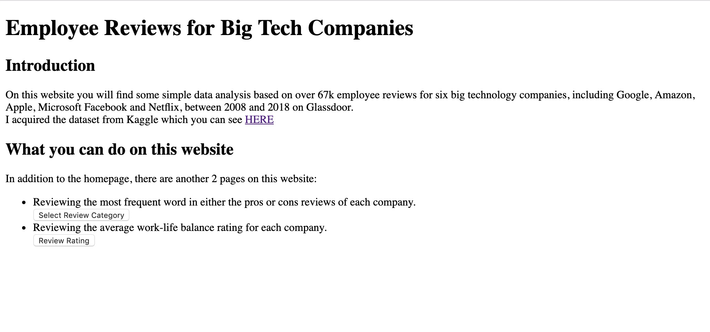

# Project Title

What employees say about Big Tech?

[Link to this repository](https://github.com/chenlicl0627/SI507-Final-Project)

---

## Project Description

This project performs some simple data analysis based on over 67k employee reviews for six big technology companies, including Google, Amazon, Apple, Microsoft Facebook and Netflix, between 2008 and 2018 on Glassdoor.

## How to run

1. First, you should install all requirements:

Make sure you have `virtualenv` installed. If you don't, use the following command to install `virtualenv`:

> pip install virtualenv

Then, `cd` to the project directory and activate `virtualenv`:

> source venv/bin/activate

Then, you can install this project's dependencies:

> pip install -r requirements.txt

2. Second, you should run `python SI507project_tools.py` to populate a sql database called "company_reviews.db". This probably will take you about 3-5 mins.


3. **VERY IMPORTANT** Once you get the database in place, comment out the following code at the end of the "SI507project_tools.py" file:
```
db.create_all()
insert_company_data("company.csv")
insert_review_data("employee_reviews.csv")
```
**AND THEN** uncomment the code at the last row of the same file:
`app.run()`

4. After you comment out and uncomment the code as instructed above, run `python SI507project_tools.py runserver` to initiate the flask app.

## How to use

1. Go to the homepage of the website by typing the url "http://127.0.0.1:5000/" in your browser (e.g. Chrome, Safari).
2. As explained on the homepage, there are 2 more routes on this website in addition to the homepage. Each route has its corresponding button which will bring you to that destination.
- Homepage
- Route 1:
  - Step 1:
  - Step 2:
- Route 2:


## Routes in this application

- `/` -> this is the homepage where you find a brief intro to this project and what you can do on this website.
- `/choose_pros_or_cons` -> This is a page for users to select a type of review for which they would like to see the result of the-most-frequent-word analysis
- `/themostfrequentwords` -> This is the result page of last route. Users will see the most frequent word(s) of the selected type of reviews for each company.
- `/work_life_balance` -> This is a page for users to review the average work-life balance rating for each company.

## How to run tests

run `python SI507project_tests.py`

## In this repository:

- SI507project_tools.py
- SI507project_db_populate.py
- SI507project_tests.py
- stopwords.py
- company.csv
- employee_reviews.csv
- README.md
- requirements.txt
- database_diagram.png
- sample_db
  - company_reviews.db
- templates
  - frequent_words.html
  - homepage.html
  - pros_or_cons_form.html
  - work_life_balance.html
- images
  - homepage.jpg

---

## Code Requirements for Grading

Please check the requirements you have accomplished in your code as demonstrated.
- [x] This is a completed requirement.
- [ ] This is an incomplete requirement.

Below is a list of the requirements listed in the rubric for you to copy and paste.  See rubric on Canvas for more details.

### General

- [x] Project is submitted as a Github repository
- [x] Project includes a working Flask application that runs locally on a computer
- [x] Project includes at least 1 test suite file with reasonable tests in it.
- [x] Includes a `requirements.txt` file containing all required modules to run program
- [x] Includes a clear and readable README.md that follows this template
- [x] Includes a sample .sqlite/.db file
- [x] Includes a diagram of your database schema
- [x] Includes EVERY file needed in order to run the project
- [x] Includes screenshots and/or clear descriptions of what your project should look like when it is working

### Flask Application

- [x] Includes at least 3 different routes
- [x] View/s a user can see when the application runs that are understandable/legible for someone who has NOT taken this course
- [x] Interactions with a database that has at least 2 tables
- [x] At least 1 relationship between 2 tables in database
- [x] Information stored in the database is viewed or interacted with in some way

### Additional Components (at least 6 required)

- [x] Use of a new module
- [ ] Use of a second new module
- [ ] Object definitions using inheritance (indicate if this counts for 2 or 3 of the six requirements in a parenthetical)
- [ ] A many-to-many relationship in your database structure
- [x] At least one form in your Flask application
- [x] Templating in your Flask application
- [x] Inclusion of JavaScript files in the application
- [x] Links in the views of Flask application page/s
- [ ] Relevant use of `itertools` and/or `collections`
- [ ] Sourcing of data using web scraping
- [ ] Sourcing of data using web REST API requests
- [x] Sourcing of data using user input and/or a downloaded .csv or .json dataset
- [ ] Caching of data you continually retrieve from the internet in some way

### Submission

- [x] I included a link to my GitHub repository with the correct permissions on Canvas! (Did you though? Did you actually? Are you sure you didn't forget?)
- [x] I included a summary of my project and how I thought it went **in my Canvas submission**!
